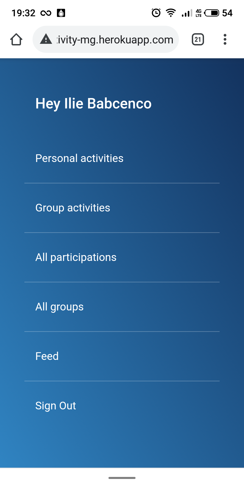
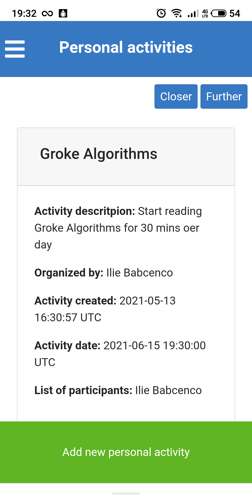
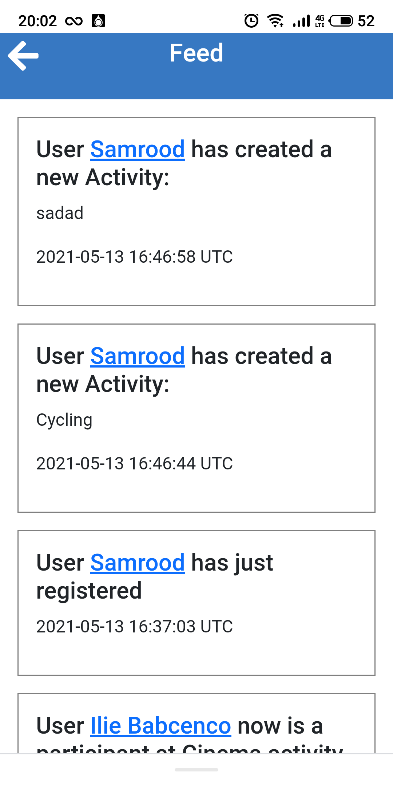
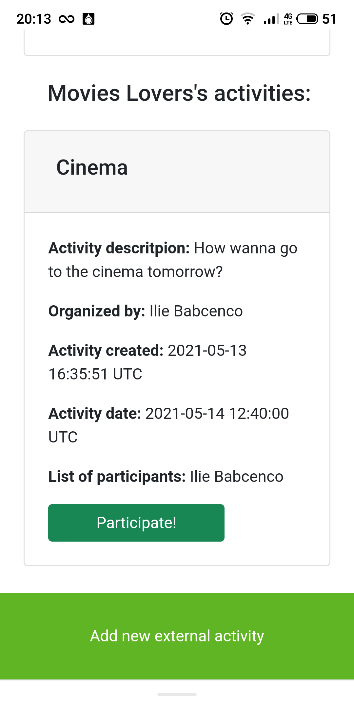

# Activities Manager

## Description

I did this project for learning purposes as a capstone project from Microverse after completing the Ruby on Rails curriculum.
It is a web app for daily activities and is intended for mobile phones.

## Built With

- Ruby on Rails
- Bootstrap

## Set up this projecect locally

- Install the following:

1. Ruby
2. Ruby on Rails
3. PostgreSQL
4. Yarn
5. Node.js

- Clone this repository by copying the link after clicking the "code" button above
- Run "bundle install" in your computer terminal to install required gems
- Run "rails server" to start the server
- Open in your browser the URL http://localhost:3000/
- Use it.

## How it looks

| View on mobile version       | View on mobile version       | View on mobile version       |
| ---------------------------- | ---------------------------- | ---------------------------- |
|  |  |  |
|  |  |

## How can I play?

1. You can connect to [Telegram](https://web.telegram.org/) and find `@ilie_smart_bot` and try to play with him :) or you may click [here](https://telegram.me/ilie_smart_bot)

### Run tests

1. Open terminal and switch to project directory
2. Write next line:

```
    rpsec --format documentation
```

### Deployment

This application is deployed on [Heroku](https://www.heroku.com/) [there](https://activity-mg.herokuapp.com/).

## Authors

👤 **Ilie Babcenco**

[](https://github.com/iliebabcenco) [](https://www.linkedin.com/in/ilie-babcenco-72459a1b1/) [](https://twitter.com/BabcencoIlie)

## 🤝 Contributing

Contributions, issues, and feature requests are welcome!

If you want to contribute, you can clone this project or fork it.

If you found an issue, feel free to check the [issues page](https://github.com/iliebabcenco/my-telegram-bot/issues).

## Show your support

Give a ⭐️ if you like this project!

## Acknowledgments

- [Microverse](https://www.microverse.org/)
