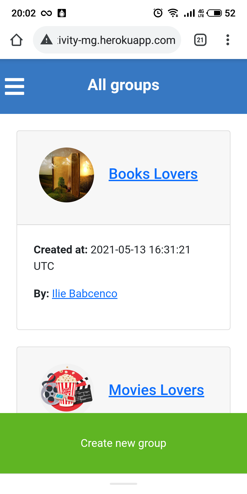

# Activities Manager

## Description

I did this project for learning purposes as a capstone project from Microverse after completing the Ruby on Rails curriculum.
It is a web app for daily activities and is intended for mobile phones.

I implemented next features in this project:

1. User's page with link for navigation;
2. Personal activities page where a user can create, see and sort all personal activities;
3. Group activities page where are displayed only public activities created by user or where user is a participant;
4. All participations page which includes all activities created by user and also where user is a participant;
5. All groups where users can create new group or select from existing to show their ideas of activities or to find something interesting activities from other users;
6. Feed page which displays all users' activities ordered by created time.

## Built With

- Ruby on Rails
- Bootstrap

## Set up this projecect locally

- Install the following:

1. Ruby
2. Ruby on Rails
3. PostgreSQL
4. Yarn
5. Node.js

- Clone this repository by copying the link after clicking the "code" button above
- Run "bundle install" in your computer terminal to install required gems
- Run "rails server" to start the server
- Open in your browser the URL http://localhost:3000/
- Use it.

## How it looks

| View on mobile version       | View on mobile version       | View on mobile version       |
| ---------------------------- | ---------------------------- | ---------------------------- |
|  |  |  |
|  |  |

## How can I play?

1. You can connect to [Telegram](https://web.telegram.org/) and find `@ilie_smart_bot` and try to play with him :) or you may click [here](https://telegram.me/ilie_smart_bot)

### Run tests

1. Open terminal and switch to project directory
2. Write next line:

```
    rpsec --format documentation
```

### Deployment

This application is deployed on [Heroku](https://www.heroku.com/) [there](https://activity-mg.herokuapp.com/).

## Authors

👤 **Ilie Babcenco**

[](https://github.com/iliebabcenco) [](https://www.linkedin.com/in/ilie-babcenco-72459a1b1/) [](https://twitter.com/BabcencoIlie)

## 🤝 Contributing

Contributions, issues, and feature requests are welcome!

If you want to contribute, you can clone this project or fork it.

If you found an issue, feel free to check the [issues page](https://github.com/iliebabcenco/my-telegram-bot/issues).

## Show your support

Give a ⭐️ if you like this project!

## Acknowledgments

- [Microverse](https://www.microverse.org/)
